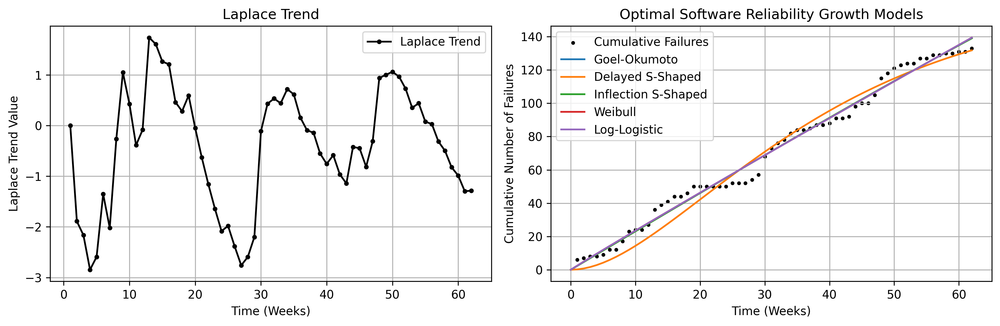

# Laplace Trend and Optimal SRGMs

- The left graph shows the Laplace trend, where a positive value indicates an increasing trend of software failures, and a negative value indicates a decreasing trend of software failures.
- The right graph illustrates the cumulative number of software failures together with the optimized SRGMs.

---

# Summary of SRGM Optimization Results

- The tables below provide the MSE, RMSE, MAE, MAPE, and R2 score metrics obtained from each optimization algorithm applied to the SRGMs.

## Goel-Okumoto Model

|Algorithms|MSE|RMSE|MAE|MAPE|R2 score|
|:---|:---:|:---:|:---:|:---:|:---:|
|(LSM) trf|20.892|4.570|3.801|0.087|0.987|
|(LSM) dogbox|20.892|4.570|3.801|0.087|0.987|
|(MLE) Nelder-Mead|41.280|6.424|5.188|0.100|0.975|
|(MLE) Powell|27.071|5.203|4.029|0.093|0.983|
|(MLE) L-BFGS-B|27.071|5.203|4.029|0.093|0.983|
|(MLE) TNC|27.071|5.203|4.029|0.093|0.983|
|(MLE) COBYQA|27.071|5.203|4.029|0.093|0.983|
|(MLE) SLSQP|27.071|5.202|4.029|0.093|0.983|
|(MLE) trust-constr|27.072|5.203|4.029|0.093|0.983|

## Delayed S-Shape Model

|Algorithms|MSE|RMSE|MAE|MAPE|R2 score|
|:---|:---:|:---:|:---:|:---:|:---:|
|(LSM) trf|47.757|6.910|5.851|0.178|0.971|
|(LSM) dogbox|47.757|6.910|5.851|0.178|0.971|
|(MLE) Nelder-Mead|51.406|7.169|6.073|0.176|0.969|
|(MLE) Powell|51.317|7.163|6.068|0.176|0.969|
|(MLE) L-BFGS-B|51.341|7.165|6.069|0.176|0.969|
|(MLE) TNC|51.341|7.165|6.069|0.176|0.969|
|(MLE) COBYQA|51.341|7.165|6.069|0.176|0.969|
|(MLE) SLSQP|51.344|7.165|6.069|0.176|0.969|
|(MLE) trust-constr|51.341|7.165|6.069|0.176|0.969|

## Inflection S-Shape Model

|Algorithms|MSE|RMSE|MAE|MAPE|R2 score|
|:---|:---:|:---:|:---:|:---:|:---:|
|(LSM) trf|20.872|4.568|3.795|0.087|0.987|
|(LSM) dogbox|20.872|4.568|3.795|0.087|0.987|
|(MLE) Nelder-Mead|24.812|4.981|4.007|0.088|0.985|
|(MLE) Powell|24.812|4.981|4.007|0.088|0.985|
|(MLE) L-BFGS-B|41.280|6.424|5.188|0.100|0.975|
|(MLE) TNC|41.280|6.424|5.188|0.100|0.975|
|(MLE) COBYQA|24.812|4.981|4.007|0.088|0.985|
|(MLE) SLSQP|24.812|4.981|4.007|0.088|0.985|
|(MLE) trust-constr|24.812|4.981|4.007|0.088|0.985|

## Weibull Model

|Algorithms|MSE|RMSE|MAE|MAPE|R2 score|
|:---|:---:|:---:|:---:|:---:|:---:|
|(LSM) trf|20.838|4.564|3.800|0.087|0.987|
|(LSM) dogbox|156.796|12.521|10.903|0.333|0.906|
|(MLE) Nelder-Mead|28.786|5.365|4.168|0.100|0.982|
|(MLE) Powell|27.695|5.262|4.051|0.096|0.983|
|(MLE) L-BFGS-B|28.093|5.300|4.087|0.098|0.983|
|(MLE) TNC|28.093|5.300|4.087|0.098|0.983|
|(MLE) COBYQA|28.093|5.300|4.087|0.098|0.983|
|(MLE) SLSQP|28.089|5.299|4.087|0.098|0.983|
|(MLE) trust-constr|28.093|5.300|4.087|0.098|0.983|

## Log-Logistic Model

|Algorithms|MSE|RMSE|MAE|MAPE|R2 score|
|:---|:---:|:---:|:---:|:---:|:---:|
|(LSM) trf|20.840|4.565|3.800|0.087|0.987|
|(LSM) dogbox|22.603|4.754|3.834|0.093|0.986|
|(MLE) Nelder-Mead|28.209|5.311|4.106|0.098|0.983|
|(MLE) Powell|27.149|5.210|4.035|0.093|0.983|
|(MLE) L-BFGS-B|28.209|5.311|4.106|0.098|0.983|
|(MLE) TNC|28.209|5.311|4.106|0.098|0.983|
|(MLE) COBYQA|28.209|5.311|4.106|0.098|0.983|
|(MLE) SLSQP|28.209|5.311|4.106|0.098|0.983|
|(MLE) trust-constr|28.209|5.311|4.106|0.098|0.983|
