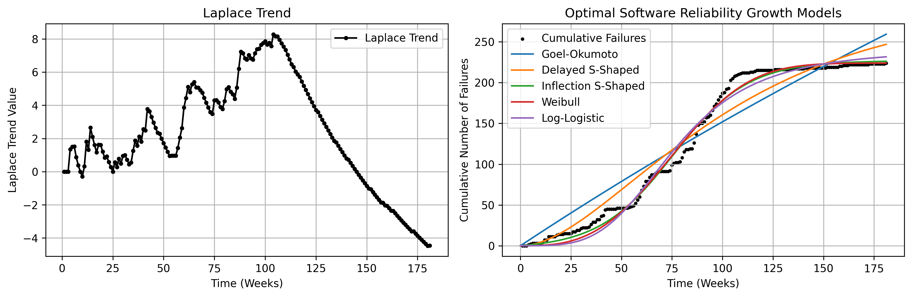

# Laplace Trend and Optimal SRGMs

- The left graph shows the Laplace trend, where a positive value indicates an increasing trend of software failures, and a negative value indicates a decreasing trend of software failures.
- The right graph illustrates the cumulative number of software failures together with the optimized SRGMs.

---

# Summary of SRGM Optimization Results

- The tables below provide the MSE, RMSE, MAE, MAPE, and R2 score metrics obtained from each optimization algorithm applied to the SRGMs.

## Goel-Okumoto Model

|Algorithms|MSE|RMSE|MAE|MAPE|R2 score|
|:---|:---:|:---:|:---:|:---:|:---:|
|(LSM) trf|613.917|24.777|21.882|242481418868109.5|0.917|
|(LSM) dogbox|613.917|24.777|21.882|242481213636257.75|0.917|
|(MLE) Nelder-Mead|1278.685|35.758|27.337|183742515832538.12|0.827|
|(MLE) Powell|822.292|28.675|25.314|294901133700778.56|0.889|
|(MLE) L-BFGS-B|822.292|28.675|25.314|294901021899337.7|0.889|
|(MLE) TNC|822.292|28.675|25.314|294901021899337.7|0.889|
|(MLE) COBYQA|822.292|28.675|25.314|294901136146986.3|0.889|
|(MLE) SLSQP|822.292|28.675|25.314|294900740732883.6|0.889|
|(MLE) trust-constr|822.295|28.675|25.314|294906143447328.7|0.889|

## Delayed S-Shape Model

|Algorithms|MSE|RMSE|MAE|MAPE|R2 score|
|:---|:---:|:---:|:---:|:---:|:---:|
|(LSM) trf|311.451|17.647|14.636|16642284505691.72|0.958|
|(LSM) dogbox|311.451|17.647|14.636|16642366549521.283|0.958|
|(MLE) Nelder-Mead|417.674|20.437|16.729|20868445678922.58|0.943|
|(MLE) Powell|417.617|20.435|16.728|20861204439550.59|0.943|
|(MLE) L-BFGS-B|417.617|20.435|16.728|20861198334070.44|0.943|
|(MLE) TNC|417.617|20.435|16.728|20861198334070.44|0.943|
|(MLE) COBYQA|417.617|20.435|16.728|20861205268769.72|0.943|
|(MLE) SLSQP|417.617|20.435|16.728|20861188487671.453|0.943|
|(MLE) trust-constr|417.622|20.435|16.728|20861835003865.66|0.943|

## Inflection S-Shape Model

|Algorithms|MSE|RMSE|MAE|MAPE|R2 score|
|:---|:---:|:---:|:---:|:---:|:---:|
|(LSM) trf|60.576|7.783|6.144|31929077724291.27|0.991|
|(LSM) dogbox|562.518|23.717|21.288|193712945718405.97|0.924|
|(MLE) Nelder-Mead|62.610|7.912|5.806|33851363276860.727|0.991|
|(MLE) Powell|62.610|7.912|5.806|33851419419537.418|0.991|
|(MLE) L-BFGS-B|1278.689|35.758|27.337|183742136299017.3|0.827|
|(MLE) TNC|1278.689|35.758|27.337|183742136299017.3|0.827|
|(MLE) COBYQA|62.610|7.912|5.806|33851391278005.633|0.991|
|(MLE) SLSQP|62.607|7.912|5.806|33844377649146.395|0.991|
|(MLE) trust-constr|62.611|7.912|5.806|33854166343812.406|0.991|

## Weibull Model

|Algorithms|MSE|RMSE|MAE|MAPE|R2 score|
|:---|:---:|:---:|:---:|:---:|:---:|
|(LSM) trf|70.778|8.413|6.625|370409811209.131|0.990|
|(LSM) dogbox|275.782|16.606|13.339|16681751585742.947|0.962|
|(MLE) Nelder-Mead|1243.349|35.261|27.108|197999526718379.25|0.832|
|(MLE) Powell|15767.680|125.569|91.605|1.662e+16|-1.123|
|(MLE) L-BFGS-B|102.134|10.106|7.259|2047198861197.365|0.986|
|(MLE) TNC|102.134|10.106|7.259|2047198861197.365|0.986|
|(MLE) COBYQA|230.509|15.182|11.119|11914254357911.625|0.968|
|(MLE) SLSQP|101.592|10.079|7.247|2031471891532.023|0.986|
|(MLE) trust-constr|101.901|10.094|7.255|2028888233392.829|0.986|

## Log-Logistic Model

|Algorithms|MSE|RMSE|MAE|MAPE|R2 score|
|:---|:---:|:---:|:---:|:---:|:---:|
|(LSM) trf|121.754|11.034|9.042|36800475859.994|0.983|
|(LSM) dogbox|121.754|11.034|9.042|36801173340.284|0.983|
|(MLE) Nelder-Mead|1243.349|35.261|27.108|197998398140836.62|0.832|
|(MLE) Powell|11005.295|104.906|76.101|9690206142443306.0|-0.482|
|(MLE) L-BFGS-B|199.929|14.139|10.912|693162637423.615|0.973|
|(MLE) TNC|199.929|14.139|10.912|693162637423.615|0.973|
|(MLE) COBYQA|199.941|14.140|10.913|693401838721.765|0.973|
|(MLE) SLSQP|199.930|14.139|10.912|693160438397.039|0.973|
|(MLE) trust-constr|199.929|14.139|10.912|693167518540.359|0.973|
