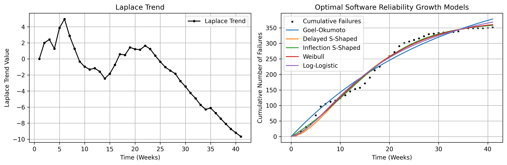

# Laplace Trend and Optimal SRGMs

- The left graph shows the Laplace trend, where a positive value indicates an increasing trend of software failures, and a negative value indicates a decreasing trend of software failures.
- The right graph illustrates the cumulative number of software failures together with the optimized SRGMs.

---

# Summary of SRGM Optimization Results

- The tables below provide the MSE, RMSE, MAE, MAPE, and R2 score metrics obtained from each optimization algorithm applied to the SRGMs.

## Goel-Okumoto Model

|Algorithms|MSE|RMSE|MAE|MAPE|R2 score|
|:---|:---:|:---:|:---:|:---:|:---:|
|(LSM) trf|321.202|17.922|15.450|0.187|0.976|
|(LSM) dogbox|321.202|17.922|15.450|0.187|0.976|
|(MLE) Nelder-Mead|477.027|21.840|19.139|0.237|0.965|
|(MLE) Powell|476.883|21.837|19.137|0.237|0.965|
|(MLE) L-BFGS-B|476.883|21.837|19.137|0.237|0.965|
|(MLE) TNC|476.883|21.837|19.137|0.237|0.965|
|(MLE) COBYQA|476.883|21.837|19.137|0.237|0.965|
|(MLE) SLSQP|476.884|21.837|19.137|0.237|0.965|
|(MLE) trust-constr|476.886|21.837|19.137|0.237|0.965|

## Delayed S-Shape Model

|Algorithms|MSE|RMSE|MAE|MAPE|R2 score|
|:---|:---:|:---:|:---:|:---:|:---:|
|(LSM) trf|190.616|13.806|10.528|0.095|0.986|
|(LSM) dogbox|190.616|13.806|10.528|0.095|0.986|
|(MLE) Nelder-Mead|227.633|15.087|11.184|0.091|0.983|
|(MLE) Powell|227.435|15.080|11.182|0.091|0.983|
|(MLE) L-BFGS-B|227.435|15.080|11.182|0.091|0.983|
|(MLE) TNC|227.435|15.080|11.182|0.091|0.983|
|(MLE) COBYQA|227.435|15.080|11.182|0.091|0.983|
|(MLE) SLSQP|227.435|15.080|11.182|0.091|0.983|
|(MLE) trust-constr|227.435|15.080|11.182|0.091|0.983|

## Inflection S-Shape Model

|Algorithms|MSE|RMSE|MAE|MAPE|R2 score|
|:---|:---:|:---:|:---:|:---:|:---:|
|(LSM) trf|122.261|11.057|8.262|0.088|0.991|
|(LSM) dogbox|122.261|11.057|8.262|0.088|0.991|
|(MLE) Nelder-Mead|132.342|11.504|8.112|0.085|0.990|
|(MLE) Powell|132.343|11.504|8.112|0.085|0.990|
|(MLE) L-BFGS-B|132.342|11.504|8.112|0.085|0.990|
|(MLE) TNC|132.340|11.503|8.111|0.085|0.990|
|(MLE) COBYQA|132.342|11.504|8.112|0.085|0.990|
|(MLE) SLSQP|132.342|11.504|8.112|0.085|0.990|
|(MLE) trust-constr|132.342|11.504|8.112|0.085|0.990|

## Weibull Model

|Algorithms|MSE|RMSE|MAE|MAPE|R2 score|
|:---|:---:|:---:|:---:|:---:|:---:|
|(LSM) trf|155.694|12.477|9.601|0.070|0.988|
|(LSM) dogbox|155.694|12.477|9.601|0.070|0.988|
|(MLE) Nelder-Mead|183.440|13.544|9.632|0.070|0.986|
|(MLE) Powell|182.795|13.520|9.638|0.070|0.986|
|(MLE) L-BFGS-B|183.434|13.543|9.632|0.070|0.986|
|(MLE) TNC|183.435|13.543|9.632|0.070|0.986|
|(MLE) COBYQA|183.434|13.543|9.632|0.070|0.986|
|(MLE) SLSQP|183.425|13.543|9.632|0.070|0.986|
|(MLE) trust-constr|183.434|13.543|9.632|0.070|0.986|

## Log-Logistic Model

|Algorithms|MSE|RMSE|MAE|MAPE|R2 score|
|:---|:---:|:---:|:---:|:---:|:---:|
|(LSM) trf|203.982|14.282|11.642|0.074|0.985|
|(LSM) dogbox|203.982|14.282|11.642|0.074|0.985|
|(MLE) Nelder-Mead|277.056|16.645|13.712|0.078|0.979|
|(MLE) Powell|278.548|16.689|13.724|0.079|0.979|
|(MLE) L-BFGS-B|277.064|16.645|13.712|0.078|0.979|
|(MLE) TNC|277.063|16.645|13.712|0.078|0.979|
|(MLE) COBYQA|277.064|16.645|13.712|0.078|0.979|
|(MLE) SLSQP|277.063|16.645|13.712|0.078|0.979|
|(MLE) trust-constr|277.064|16.645|13.712|0.078|0.979|
